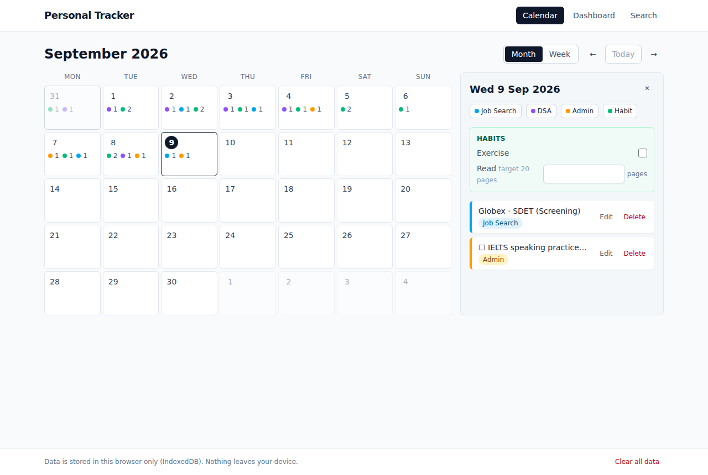
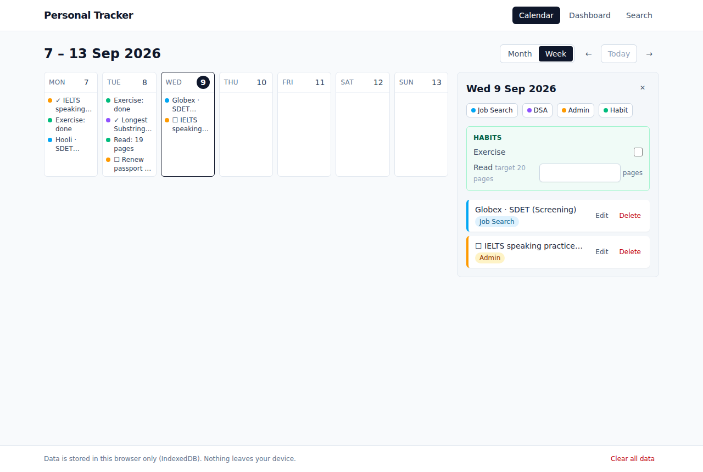
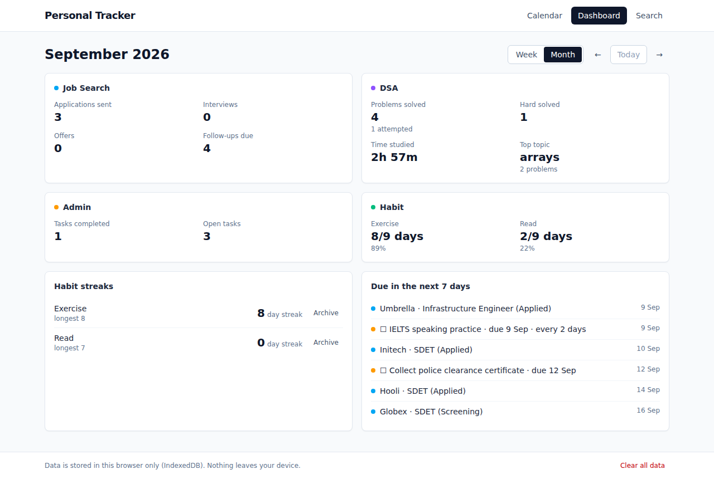
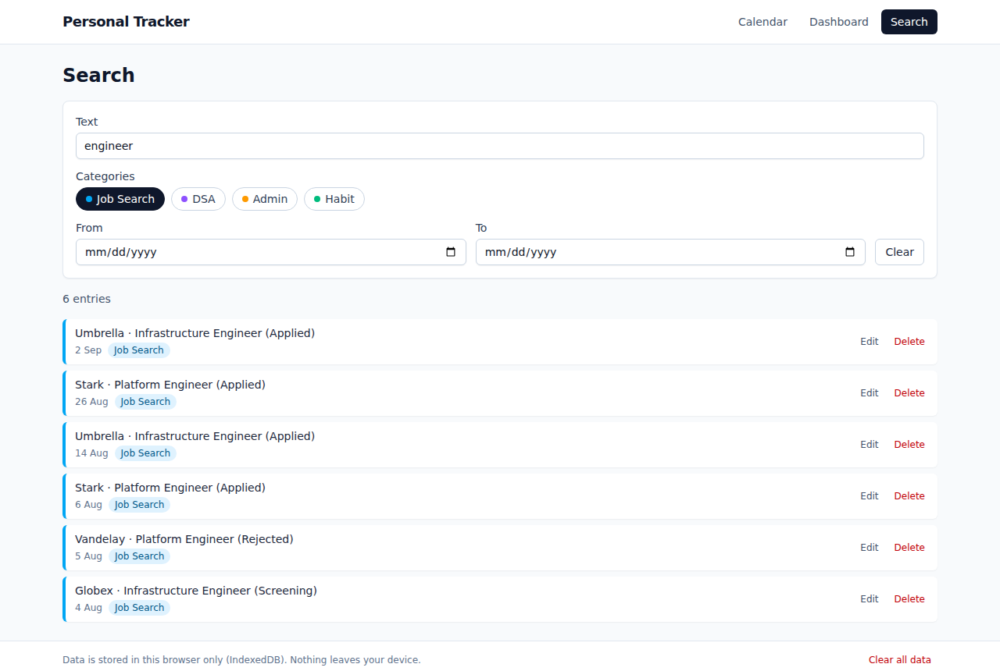
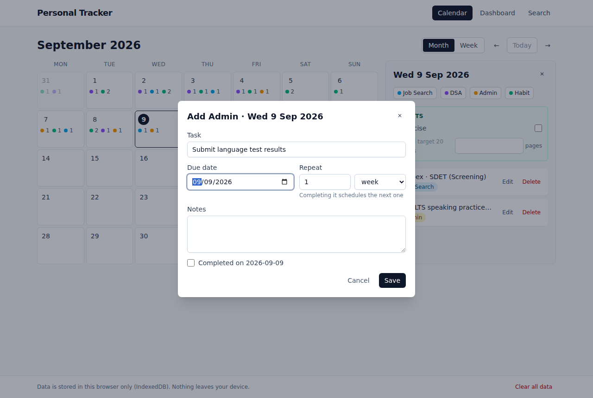

# Personal Tracker

[](https://github.com/kavikar/personal-tracker/actions/workflows/ci.yml)
[](LICENSE)

**[Live demo](https://personal-tracker-weld.vercel.app)** · [Design Doc](docs/DESIGN.md)

A calendar-centric tracker for running several concurrent goals on one date grid: job applications, technical interview prep, immigration and admin tasks, and daily habits. Local-first, no account, runs in the browser.



## Why I built this

I was juggling a job search, interview preparation, immigration paperwork, and a few habits at the same time, and every tool I tried treated those as separate apps. I wanted one calendar where a single day shows everything I did across all of them, with streaks and weekly rollups so I could tell whether I was actually making progress.

It is also a deliberate portfolio piece. I work in QA and test automation and am moving toward platform and developer productivity engineering, so the project is built the way I would want a service at work to be built: typed, tested, linted in CI, containerized, and documented, with a commit history that shows the work in the order it happened. If you are reviewing it, start with [the design document](docs/DESIGN.md), then `src/categories/` for the extension point, then `.github/workflows/ci.yml` for the pipeline.

## Features

- **Month and week views.** Click a day to open its panel, log entries, and check habits off inline.
- **Four categories, each with its own form and rollups.**
  - Job Search: company, role, pipeline status, link, next action date, notes.
  - DSA / Study: problem, link, topic tags, difficulty, minutes spent, solved.
  - Admin: one-off or recurring tasks with a due date. Completing a recurring task schedules the next one.
  - Habits: yes/no or numeric with a unit and daily target, with current and longest streaks.
- **Dashboard.** Weekly or monthly rollups per category, habit streaks, and everything due in the next seven days with overdue items first.
- **Search.** Free text, category chips, and a date range, all kept in the URL.
- **Local-first.** Data lives in IndexedDB in your browser. It survives reloads and works offline. Nothing is sent anywhere.
- **Sample data.** One click loads six weeks of believable history so the dashboard is not empty on a fresh install.
- **Dark mode.** Toggle in the header, persisted per browser, defaulting to your OS preference.
- **Responsive nav.** The header collapses into a hamburger menu on small screens.
- **Installable (PWA).** Add it to your phone or desktop home screen and it works fully offline, same as the browser tab.

## Screenshots

| Week view                                        | Dashboard                                    |
| ------------------------------------------------ | -------------------------------------------- |
|  |  |

| Search                                 | Quick-entry form                               |
| -------------------------------------- | ---------------------------------------------- |
|  |  |

## Getting started

Prerequisites: Node 22 and npm 10 or newer.

```bash
git clone https://github.com/kavikar/personal-tracker.git
cd personal-tracker
npm ci
npm run dev
```

Open http://localhost:5173. Click a day to add an entry, or use the "Load sample data" button to explore.

### Scripts

| Command                 | What it does                                             |
| ----------------------- | -------------------------------------------------------- |
| `npm run dev`           | Vite dev server with hot reload                          |
| `npm run build`         | Type-check and produce the production bundle in `dist/`  |
| `npm run preview`       | Serve the production bundle locally                      |
| `npm test`              | Unit and component tests (Vitest, jsdom, fake-indexeddb) |
| `npm run test:coverage` | Same, with a v8 coverage report in `coverage/`           |
| `npm run test:e2e`      | Playwright suite against the production build            |
| `npm run lint`          | ESLint                                                   |
| `npm run typecheck`     | TypeScript in strict mode                                |
| `npm run format`        | Prettier (also `format:check`)                           |

To run the Playwright suite the first time: `npx playwright install --with-deps chromium`. If you already have a Chromium binary, point at it with `PLAYWRIGHT_CHROMIUM_PATH=/path/to/chromium npm run test:e2e`.

### Docker

```bash
docker compose up --build
```

The app is served by nginx on http://localhost:8080. The image is built in two stages (Node for the build, nginx for serving) and is about 50 MB. See [`Dockerfile`](Dockerfile) and [`docker/nginx.conf`](docker/nginx.conf).

### Deploying to Vercel

The repository is pre-configured for Vercel with zero setup:

1. Go to [vercel.com](https://vercel.com) and sign in (or create an account).
2. Click **Add New → Project**, then **Import Git Repository**.
3. Select this repository (`kavikar/personal-tracker`).
4. Vercel will auto-detect Vite as the framework — accept the defaults.
5. Click **Deploy**.

That's it. Vercel will run the build, serve the app, and re-deploy on every push to `main`. [`vercel.json`](vercel.json) configures the single-page-app rewrite and long-lived caching for hashed assets.

Any static host works since the build output is a plain `dist/` folder; the configuration just tells the host to serve `index.html` for client routes.

## Architecture

```
┌────────────────────────────────────────────────────────────────┐
│  features/         calendar · dashboard · search · entries      │  pages and panels
├────────────────────────────────────────────────────────────────┤
│  categories/       jobSearch · dsa · admin · habit  + registry  │  one folder per category
│                    schema (Zod) · Form · describe · summarize   │  the extension point
├────────────────────────────────────────────────────────────────┤
│  lib/              dates · streaks                              │  pure, unit-tested logic
├────────────────────────────────────────────────────────────────┤
│  db/               Dexie database · Repository interface · hooks│  the persistence seam
└────────────────────────────────────────────────────────────────┘
```

**Data model.** Two tables. `entries` holds every logged item with a `date` (local `YYYY-MM-DD`), a `category` key, and an opaque `data` payload that the owning category validates with Zod on the way in and out. `habits` holds habit definitions. Because Dexie only indexes `id`, `date`, `category`, and the `[category+date]` pair, adding a category never needs a schema migration.

**Categories are plugins.** Each one implements the [`CategoryDefinition`](src/categories/types.ts) contract: a schema, a form component, a one-line `describe`, a `summarize` for the dashboard, colour tokens, and optional `dueDate`, `isDone`, and `followUp` hooks. The calendar, day panel, dashboard, and search never special-case a category; they iterate the [registry](src/categories/registry.ts). To add a category:

1. Add its key to `src/categories/keys.ts`.
2. Create `src/categories/<name>/` with `schema.ts`, `Form.tsx`, `summarize.ts`, and an `index.ts` that exports the definition.
3. Append it to `categories` in `registry.ts`.

**Persistence seam.** UI code talks to the [`Repository`](src/db/repository.ts) interface and Dexie live-query hooks, never to Dexie tables directly. A REST or sync backend can replace the implementation without touching features. Local-first was a deliberate MVP choice: every feature is single-user, so a backend would have doubled the surface area without changing what you see.

**State in the URL.** The focused month, selected day, dashboard period, and search filters are search params. Views are shareable, the back button works, and a reload lands where you were.

**Recurrence without a rule engine.** A recurring admin task stores an interval. Completing it triggers the category's `followUp` hook, which creates the next occurrence on the advanced due date. Small, explainable, and enough for "IELTS practice every 2 days".

**Dates.** Every date is a local day key. There are no timestamps in domain logic, so streaks and week boundaries do not drift across timezones. All date math goes through [`lib/dates.ts`](src/lib/dates.ts), which is fully tested.

## Testing and CI

- **Unit tests** cover the logic that matters: date math, streaks, rollups per category, schemas, filtering, the sample-data generator, and the repository (against `fake-indexeddb`).
- **Component tests** drive the day panel and habit check-in through real add, validate, edit, and delete flows with Testing Library.
- **End-to-end tests** run Playwright against the production build: persistence across reload, validation, the habit-to-streak path, and sample data across pages.
- **CI** ([`ci.yml`](.github/workflows/ci.yml)) runs on every push and pull request: lint, Prettier check, typecheck, unit tests with coverage, and the build; then the Playwright suite; then a Docker image build with a container smoke test.

## Project structure

```
.
├── .github/workflows/ci.yml
├── docker/nginx.conf
├── docs/                 DESIGN.md and screenshots
├── e2e/                  Playwright specs
├── src/
│   ├── app/              router, layout, data controls
│   ├── categories/       category contract, registry, one folder per category
│   ├── components/       Button, Modal, form primitives, badges
│   ├── db/               Dexie database, Repository, live-query hooks
│   ├── dev/              sample data generator
│   ├── features/         calendar, dashboard, search, entries
│   ├── lib/              dates, streaks
│   └── test/             Vitest setup and test helpers
├── Dockerfile, docker-compose.yml
├── playwright.config.ts, vite.config.ts, eslint.config.js
└── vercel.json
```

## Roadmap

Out of scope for the MVP, in rough priority order:

- Export and import as CSV or JSON.
- Reminders for upcoming due items.
- Trend charts (applications per week, minutes studied per week).
- A backend for auth and multi-device sync behind the existing repository interface.

## License

[MIT](LICENSE)
